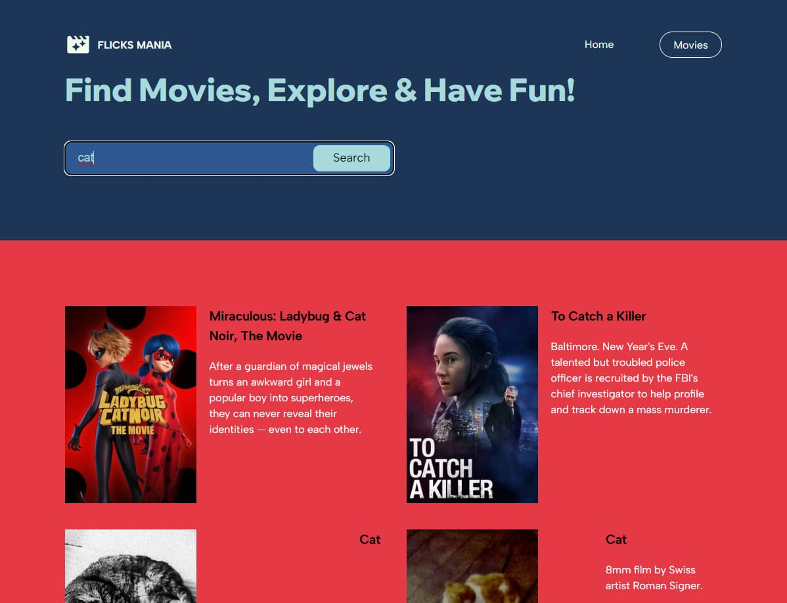

# Flicks Mania

## Overview
"Flicks Mania" is an interactive web application for searching and displaying movie information. It leverages React.js to create a user interface and interacts with an external API to fetch movie data.

  

## Features
- **Movie Search**: Users can search for movies by title.

  
  
- **Movie Details**: Detailed information is displayed upon selecting a movie, including descriptions, cast, and reviews.

  
  
## Technologies
- **React.js**: The foundation of the application, including the use of hooks and components.
- **Styled Components**: Used for component styling.
- **React Router**: For page navigation.
- **Axios**: For making HTTP requests to external APIs.
- **GitHub Actions**: For automated deployment and CI/CD.

## Installation and Launch
1. Clone the repository.
2. Install dependencies using `npm install`.
3. Run the project locally using `npm start`.

## Deployment
The project is automatically deployed to GitHub Pages upon updates to the `main` branch.
