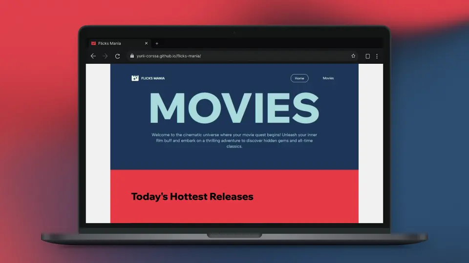

# Flicks Mania

> Welcome to Flicks Mania. This is a movie discovery app for browsing trends,
> searching by title, and viewing details with posters, actors, and reviews.
> Built to showcase frontend skills, it provides a fast and responsive user
> experience.



## Description

**Flicks Mania** is a movie discovery and search application built to showcase
frontend skills and practice modern React in a maintainable architecture. It
uses React 18 with nested routing (react-router v6), code-splitting via
React.lazy/Suspense, and integration with The Movie Database API using axios;
styles are organized with styled-components, MUI icons, and a slick carousel for
cast. Available pages include Home with trending releases, Movies with search
and URL query persistence, and Movie Details featuring poster, rating, overview,
genres, and nested Cast and Reviews. Key details include a Poster wrapper with
skeleton and fallback images, loading indicators via Suspense, and proper
configuration for GitHub Pages deployment. The result is a user-friendly, fast
interface with smooth navigation and clean design focused on maintainability.

## Key Features

- **TMDB API integration** - Axios-based data layer querying trending, search,
  details, credits, and reviews endpoints using a Bearer token.
- **Client-side routing with code-splitting** - React Router with nested routes
  and React.lazy + Suspense for route-level code splitting (Home, Movies, Movie
  Details, Cast, Reviews).
- **Shareable search with URL state** - Search flow synchronizes the query via
  `useSearchParams`, enabling deep links and back/forward navigation without
  losing state.
- **Progressive image loading** - Poster component renders lazy images with
  skeleton placeholders (react-content-loader) and graceful fallbacks for
  missing assets.
- **Responsive carousel UI** - Cast view powered by `react-slick` with custom
  Material UI arrow icons and adaptive row calculation.
- **Global styled UI** - Styling via `styled-components` v6 with a global style
  layer and component-scoped styles; Material UI icons for consistent
  iconography.

## Technology Stack

### **Frontend Technologies**

- **React** - component-based UI and hooks for state/effects.
- **React Router** - nested client-side routing and route-level code splitting.
- **Axios** - HTTP client for TMDB API requests with Bearer auth.
- **Styled Components** - CSS-in-JS styling with scoped, themeable components.
- **react-content-loader** - SVG skeletons for progressive image placeholders.
- **react-spinners** - lightweight loading indicators for Suspense fallbacks.
- **react-slick + slick-carousel** - responsive carousel for cast listings.
- **Material UI Icons** - accessible, consistent iconography.

### **Build Tools**

- **Create React App** - build/dev tooling (react-scripts).
- **ESLint** - code linting (react-app config).

## Getting Started

To run this project locally, you need to have `node` and `npm` installed.

1. Clone the repository:

   ```bash
   git clone https://github.com/yurii-corssa/flicks-mania.git
   cd flicks-mania
   ```

2. Install the dependencies:

   ```bash
   npm install
   ```

3. Run the project:

   ```bash
   npm start
   ```

## Contributing

Contributions are welcome! Feel free to create a pull request to suggest
improvements or new features.

## License

This project is open source and available under the [MIT License](LICENSE).
